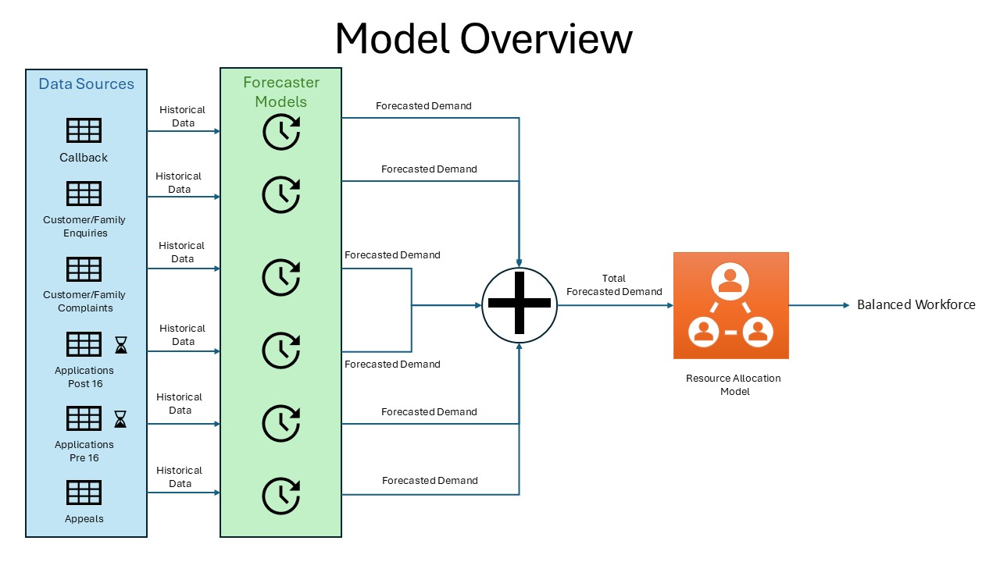

# H2S Demand Forecasting System

A robust and adaptable demand forecasting system for Home To School Transport Service, leveraging machine learning to predict resource needs across eligibility, delivery, complaints, and appeals activities.

## 📋 Table of Contents
- [Overview](#overview)
- [Features](#features)
- [Project Structure](#project-structure)
- [Installation](#installation)
- [Usage](#usage)
  - [Configuration](#configuration)
  - [Training and Forecasting](#training-and-forecasting)
  - [Interactive Analysis](#interactive-analysis)
- [Model Details](#model-details)
- [Performance Metrics](#performance-metrics)
- [Contributing](#contributing)
- [License](#license)

## 🎯 Overview

This project implements a sophisticated demand forecasting system for Home To School Transport services. By analyzing historical service data, critical path points, and seasonal patterns, the system predicts future resource requirements (permanent, fixed-term, and bank staff) across various service activities.



## ✨ Features

- **Automated Data Processing**: Converts daily records to monthly time series automatically
- **Advanced Forecasting**: Uses Facebook's Prophet model with automatic hyperparameter tuning
- **Cross-Validation**: Implements robust model validation techniques
- **Interactive Analysis**: Jupyter notebook for detailed analysis and visualization
- **Flexible Configuration**: Easy-to-modify JSON configuration system
- **Performance Metrics**: Comprehensive model evaluation with MAPE and RMSE
- **Visualization**: Interactive plots for time series and forecasts

## 📁 Project Structure

```
h2s_demand_forecast/
├── assets/              # Project assets and images
├── config/             # Configuration files
│   └── config.json    # Main configuration file
├── data/              # Data directory for input files
├── models/            # Saved trained models
├── output/            # Model outputs and metrics
├── model.py           # Combined training and forecasting script
├── util.py            # Utility functions
├── modeling.ipynb     # Interactive analysis notebook
└── requirements.txt   # Python dependencies
```

## 🚀 Installation

1. **Clone the Repository**
   ```bash
   git clone https://github.com/ehsantaati/h2s_demand_forecast.git
   cd h2s_demand_forecast
   ```

2. **Create a Virtual Environment (Optional but Recommended)**
   ```bash
   python -m venv venv
   source venv/bin/activate  # On Windows: venv\Scripts\activate
   ```

3. **Install Dependencies**
   ```bash
   pip install -r requirements.txt
   ```

## 💻 Usage

### Configuration

Create or modify `config/config.json` with your settings:

```json
{
    "model_id": "h2s_forecast",
    "normalize": false,
    "test_size": 6,
    "date_column": "Created"
}
```

Key parameters:
- `model_id`: Unique identifier for the model and its outputs
- `normalize`: Whether to apply log transformation to the data
- `test_size`: Number of months for testing (default: 6)
- `date_column`: Name of the date column in your data

### Training and Forecasting

1. **Prepare Your Data**
   - Place your Excel files in the `data` directory
   - Ensure files contain the specified date column
   - Data should be in daily format (will be aggregated to monthly)

2. **Run the Model**
   ```bash
   python model.py --config config/config.json
   ```
   
   The unified process includes:
   - Data preprocessing and validation
   - Hyperparameter tuning via cross-validation
   - Model training and evaluation
   - Immediate forecasting using the trained model
   - Saving model, metrics, and forecasts

3. **Additional Options**
   ```bash
   # For a 12-month forecast horizon
   python model.py --config config/config.json --horizon 12
   
   # For a 24-month forecast horizon
   python model.py --config config/config.json --horizon 24
   ```
   
   Key parameters:
   - `--config`: Path to configuration file (default: config/config.json)
   - `--horizon`: Forecasting horizon in months (default: 6) - can be increased for longer-term forecasts

4. **Check Results**
   - Trained model saved in `models/{model_id}/`
   - Performance metrics and forecasts saved in `output/{model_id}/`

### Interactive Analysis

Use the Jupyter notebook for detailed analysis:
```bash
jupyter notebook modeling.ipynb
```

The notebook provides:
- Interactive data exploration
- Detailed model training process
- Visual performance analysis
- Forecast visualization

## 🔍 Model Details

The system uses Facebook's Prophet model, which is particularly effective for time series with:
- Strong seasonal patterns
- Missing data
- Outliers
- Trend changes

Key features of the modeling approach:
- Automatic seasonality detection
- Robust to missing data
- Handles outliers effectively
- Configurable changepoint detection
- Uncertainty estimation

## 📊 Performance Metrics

The model's performance is evaluated using:
- **MAPE** (Mean Absolute Percentage Error)
- **RMSE** (Root Mean Square Error)

Results are saved in JSON format with:
- Overall metrics
- Cross-validation results
- Forecast confidence intervals

