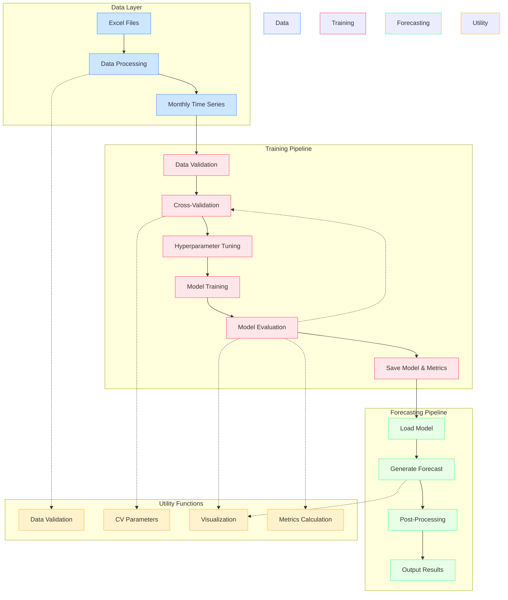

## 🔄 Model Architecture

The diagram above illustrates the main components and data flow of the H2S Demand Forecasting System:

1. **Data Layer**: Handles data ingestion and preprocessing
2. **Training Pipeline**: Manages model training and evaluation
3. **Forecasting Pipeline**: Handles prediction generation
4. **Utility Functions**: Provides shared functionality across components

Each component is designed to be modular and maintainable, with clear separation of concerns and robust error handli.

